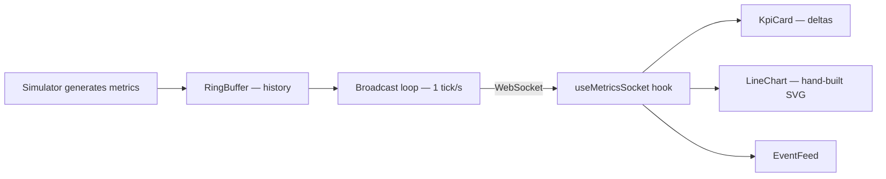

<!-- ══════════════════════════ TITLE ══════════════════════════ -->
<div align="center">
  
</div>

<br/>

<!-- ══════════════════════ IDIOMAS / LANGUAGES ══════════════════════ -->
<div align="center">
<a href="README.md"></a>
<a href="README.en.md"></a>
<a href="README.es.md"></a>
</div>

<br/>

<div align="center">
  
</div>

<br/>

<div align="center">


<br/>


</div>

<div align="center">
<a href="#about"></a>
<a href="#highlights"></a>
<a href="#architecture"></a>
<a href="#tech-stack"></a>
<a href="#usage"></a>
</div>

<br/>

> 💡 **npm workspaces monorepo.** `npm install && npm run dev` starts the WebSocket server and the front end together — dashboard at `localhost:5173`.

## About

**Pulse** is a live operations dashboard that streams system metrics over **WebSockets** and renders them with **hand-built SVG charts** — no charting library. KPI cards with trend deltas, two live time-series charts, a streaming event feed, automatic reconnection, and a polished dark UI.

A focused demo of real-time front-end engineering: WebSocket data flow, rolling time-series state, custom data-viz, and resilient reconnection.

## Highlights

| Feature | What it does |
|---|---|
| **Live WebSocket stream** | A Node `ws` server pushes a metrics tick every second; the client renders it instantly |
| **Hand-rolled SVG charts** | Responsive line + area charts from scratch (no Recharts/Chart.js), non-scaling strokes, gradient fills |
| **Rolling time-series state** | Custom React hook keeps a capped 120-point window and a 60-event feed |
| **Resilient reconnection** | Exponential backoff with a live connection indicator (Live / Connecting / Reconnecting) |
| **Trend deltas** | Each KPI shows % change vs the previous tick, color-coded (inverted for "lower is better" metrics) |
| **Realistic simulator** | Bounded random walks with correlated spikes; deterministic under an injected RNG (testable) |

## Architecture

**npm workspaces monorepo:**

| Package | Responsibility |
|---|---|
| `server/` | WebSocket server, metrics `Simulator`, `RingBuffer` history, broadcast loop |
| `web/` | React dashboard — `useMetricsSocket` hook, `LineChart`, `KpiCard`, `EventFeed` |



## Tech Stack

| Layer | Technology |
|---|---|
| Frontend | React 19, Vite 6, TypeScript, Tailwind CSS v4 |
| Backend | Node, `ws`, TypeScript (`tsx`) |
| Tooling | npm workspaces, `concurrently`, Vitest |

## Usage

```bash
npm install
npm run dev
```

- App: **http://localhost:5173**
- WebSocket: **ws://localhost:8787**

Stop the server (`Ctrl+C`) to see the client flip to **Reconnecting…**, then restart it to watch it recover automatically.

**Tests:**
```bash
npm test
```
Covers `RingBuffer` and `Simulator` — including that every generated metric stays within bounds over thousands of ticks, deterministic under a fixed RNG.

## License

[MIT](LICENSE).

<div align="center">
  
</div>

<p align="center"><sub>Built by <strong><a href="https://github.com/geoggrigori">Grigori</a></strong> · 2026</sub></p>
