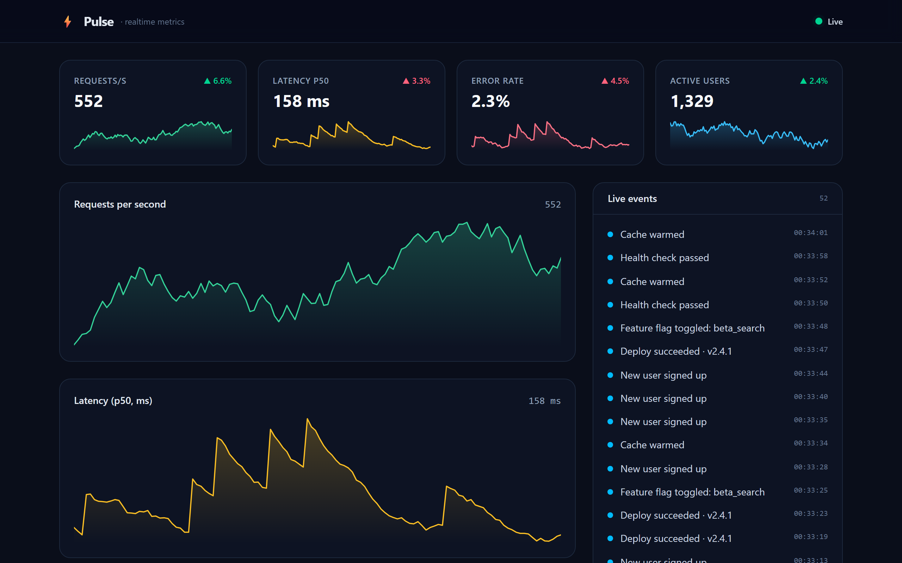
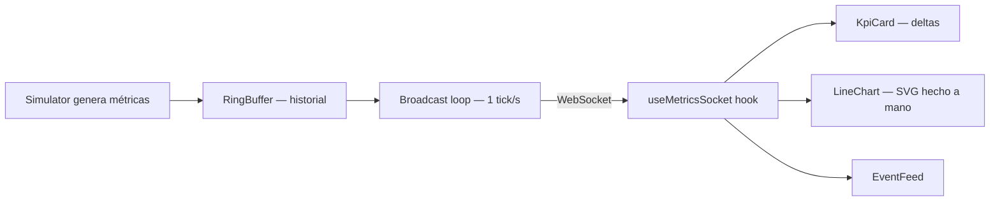

<!-- ══════════════════════ IDIOMAS / LANGUAGES ══════════════════════ -->
<div align="center">
<a href="README.md"></a>
<a href="README.en.md"></a>
<a href="README.es.md"></a>
</div>

<div align="center">
  
</div>

<br/>

<h1 align="center">Pulse — Dashboard de Métricas en Tiempo Real</h1>
<p align="center"><em>Métricas de operación en vivo vía WebSocket, con gráficos SVG hechos a mano — sin librería de gráficos</em></p>
<p align="center"><strong>Servidor WebSocket → stream de métricas → gráficos + KPIs en vivo, con reconexión automática</strong></p>

<div align="center">


<br/>


</div>

<div align="center">
<a href="#acerca-de"></a>
<a href="#destacados"></a>
<a href="#arquitectura"></a>
<a href="#tecnologías"></a>
<a href="#uso"></a>
</div>

<br/>

> 💡 **Monorepo con npm workspaces.** `npm install && npm run dev` levanta el servidor WebSocket y el frontend juntos — dashboard en `localhost:5173`.



## Acerca de

**Pulse** es un dashboard de operaciones en vivo que transmite métricas de sistema vía **WebSocket** y las renderiza con **gráficos SVG hechos a mano** — sin ninguna librería de gráficos. Tarjetas de KPI con variación porcentual, dos gráficos de serie temporal en vivo, feed de eventos en streaming, reconexión automática y una UI oscura y pulida.

Una demostración enfocada de ingeniería front-end en tiempo real: flujo de datos vía WebSocket, estado de serie temporal con ventana deslizante, visualización de datos construida desde cero y reconexión resiliente.

## Destacados

| Función | Qué hace |
|---|---|
| **Stream WebSocket en vivo** | Servidor Node (`ws`) envía una métrica por segundo; el cliente renderiza al instante |
| **Gráficos SVG desde cero** | Línea + área, responsivos, sin Recharts/Chart.js — trazo no escalable y degradados |
| **Estado de serie temporal** | Hook React custom mantiene una ventana de 120 puntos y un feed de 60 eventos |
| **Reconexión resiliente** | Backoff exponencial con indicador de conexión (Live / Conectando / Reconectando) |
| **Deltas de tendencia** | Cada KPI muestra variación % vs. el tick anterior, coloreado (invertido para métricas "menor es mejor") |
| **Simulador realista** | Random walk acotado con picos correlacionados; determinístico bajo RNG inyectado (testeable) |

## Arquitectura

**Monorepo con npm workspaces:**

| Paquete | Responsabilidad |
|---|---|
| `server/` | Servidor WebSocket, `Simulator` de métricas, historial `RingBuffer`, loop de broadcast |
| `web/` | Dashboard React — hook `useMetricsSocket`, `LineChart`, `KpiCard`, `EventFeed` |



## Tecnologías

| Capa | Tecnología |
|---|---|
| Frontend | React 19, Vite 6, TypeScript, Tailwind CSS v4 |
| Backend | Node, `ws`, TypeScript (`tsx`) |
| Tooling | npm workspaces, `concurrently`, Vitest |

## Uso

```bash
npm install
npm run dev
```

- App: **http://localhost:5173**
- WebSocket: **ws://localhost:8787**

Detén el servidor (`Ctrl+C`) para ver el cliente cambiar a **Reconectando…**, y reinícialo para ver la recuperación automática.

**Pruebas:**
```bash
npm test
```
Cubren `RingBuffer` y `Simulator` — incluyendo que cada métrica generada se mantiene dentro de los límites en miles de ticks, determinístico bajo RNG fijo.

## Licencia

[MIT](LICENSE).

<div align="center">
  
</div>

<p align="center"><sub>Desarrollado por <strong><a href="https://github.com/geoggrigori">Grigori</a></strong> · Proyecto de portafolio · 2026</sub></p>
