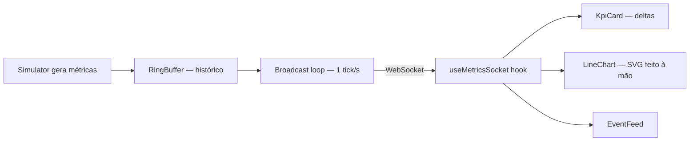

<!-- ══════════════════════════ TÍTULO ══════════════════════════ -->
<div align="center">
  
</div>

<!-- ══════════════════════ IDIOMAS / LANGUAGES ══════════════════════ -->
<div align="center">
<a href="README.md"></a>
<a href="README.en.md"></a>
<a href="README.es.md"></a>
</div>

<div align="center">
  
</div>

<br/>

<h1 align="center">Pulse — Dashboard de Métricas em Tempo Real</h1>
<p align="center"><em>Métricas de operação ao vivo, via WebSocket, com gráficos SVG feitos à mão — sem lib de gráficos</em></p>
<p align="center"><strong>Servidor WebSocket → stream de métricas → gráficos + KPIs ao vivo, com reconexão automática</strong></p>

<div align="center">


<br/>


</div>

<div align="center">
<a href="#sobre"></a>
<a href="#destaques"></a>
<a href="#arquitetura"></a>
<a href="#tecnologias"></a>
<a href="#uso"></a>
</div>

<br/>

> 💡 **Monorepo com npm workspaces.** `npm install && npm run dev` sobe o servidor WebSocket e o front juntos — dashboard em `localhost:5173`.

## Sobre

**Pulse** é um dashboard de operações ao vivo que transmite métricas de sistema via **WebSocket** e renderiza tudo com **gráficos SVG feitos à mão** — sem nenhuma lib de charts. Cards de KPI com variação percentual, dois gráficos de série temporal ao vivo, feed de eventos em streaming, reconexão automática e UI escura e polida.

Uma demonstração focada de engenharia front-end em tempo real: fluxo de dados via WebSocket, estado de série temporal com janela deslizante, visualização de dados construída do zero e reconexão resiliente.

## Destaques

| Recurso | O que faz |
|---|---|
| **Stream WebSocket ao vivo** | Servidor Node (`ws`) envia uma métrica por segundo; o cliente renderiza instantaneamente |
| **Gráficos SVG do zero** | Linha + área, responsivos, sem Recharts/Chart.js — stroke não-escalável e gradientes |
| **Estado de série temporal** | Hook React custom mantém janela de 120 pontos e feed de 60 eventos, com append eficiente |
| **Reconexão resiliente** | Backoff exponencial com indicador de conexão (Live / Conectando / Reconectando) |
| **Deltas de tendência** | Cada KPI mostra variação % vs. o tick anterior, colorido (invertido para métricas "menor é melhor") |
| **Simulador realista** | Random walk limitado com picos correlacionados de latência/erro; determinístico sob RNG injetado (testável) |

## Arquitetura

**Monorepo com npm workspaces:**

| Pacote | Responsabilidade |
|---|---|
| `server/` | Servidor WebSocket, `Simulator` de métricas, histórico `RingBuffer`, loop de broadcast |
| `web/` | Dashboard React — hook `useMetricsSocket`, `LineChart`, `KpiCard`, `EventFeed` |



## Tecnologias

| Camada | Tecnologia |
|---|---|
| Frontend | React 19, Vite 6, TypeScript, Tailwind CSS v4 |
| Backend | Node, `ws`, TypeScript (`tsx`) |
| Tooling | npm workspaces, `concurrently`, Vitest |

## Uso

```bash
npm install
npm run dev
```

- App: **http://localhost:5173**
- WebSocket: **ws://localhost:8787**

Pare o servidor (`Ctrl+C`) para ver o cliente mudar para **Reconectando…**, e reinicie para ver a recuperação automática.

**Testes:**
```bash
npm test
```
Cobrem `RingBuffer` e `Simulator` — inclusive que toda métrica gerada fica dentro dos limites em milhares de ticks, com saída determinística sob RNG fixo.

## Licença

[MIT](LICENSE).

<div align="center">
  
</div>

<p align="center"><sub>Desenvolvido por <strong><a href="https://github.com/geoggrigori">Grigori</a></strong> · 2026</sub></p>
