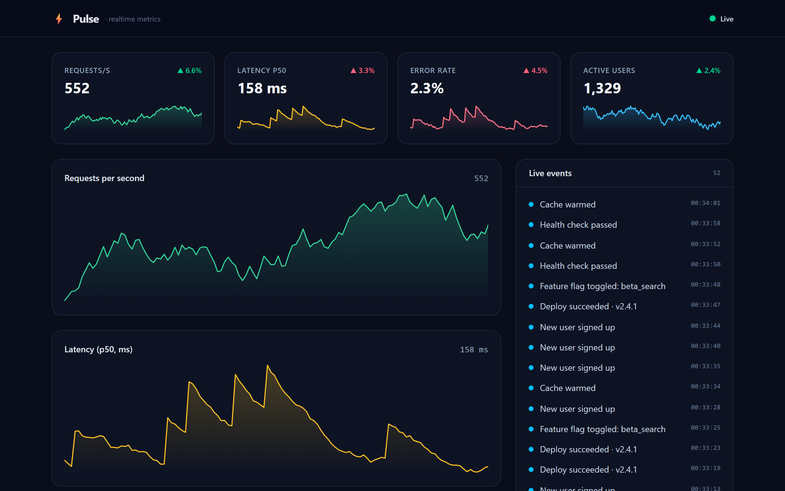

# Pulse ⚡ — Painel de Métricas em Tempo Real

[English](README.md) · **Português** · [Español](README.es.md)

Um painel operacional ao vivo que transmite métricas do sistema por **WebSockets** e as renderiza com **gráficos SVG feitos à mão** — sem nenhuma biblioteca de gráficos. Cartões de KPI com variações de tendência, dois gráficos de séries temporais ao vivo, um feed de eventos em streaming, reconexão automática e uma interface escura caprichada.

> Uma demonstração focada em engenharia front-end em tempo real: fluxo de dados via WebSocket, estado de séries temporais contínuas, visualização de dados sob medida e reconexão resiliente.

  

---



## ✨ Destaques

- **Stream ao vivo via WebSocket** — um servidor Node `ws` envia um tick de métricas a cada segundo; o cliente o renderiza instantaneamente.
- **Gráficos SVG feitos à mão** — gráficos de linha + área responsivos construídos do zero (sem Recharts/Chart.js), com traços de espessura constante e preenchimentos em gradiente.
- **Estado de séries temporais contínuas** — um hook React personalizado mantém uma janela limitada de 120 pontos e um feed de 60 eventos, anexando cada tick de forma eficiente.
- **Reconexão resiliente** — backoff exponencial com um indicador de conexão ao vivo (Ao vivo / Conectando / Reconectando).
- **Variações de tendência** — cada KPI mostra a variação percentual em relação ao tick anterior, com cores indicativas (e invertidas para métricas em que "menor é melhor", como latência e taxa de erro).
- **Simulador realista** — passeios aleatórios limitados com picos correlacionados de latência/erro e eventos correspondentes; determinístico sob um RNG injetado (e, portanto, testável).
- **Interface escura e responsiva** — Tailwind CSS v4, adaptando-se de telas móveis a telas largas.

## 🏗️ Arquitetura


Este é um **monorepo com npm workspaces**:

| Pacote | Responsabilidade |
|---------|----------------|
| `server/` | Servidor WebSocket, `Simulator` de métricas, histórico `RingBuffer`, loop de broadcast |
| `web/`    | Painel React — hook `useMetricsSocket`, `LineChart`, `KpiCard`, `EventFeed` |

## 🚀 Primeiros passos

```bash
# install both workspaces
npm install

# run the WebSocket server and the web app together
npm run dev
```

- Aplicação web: **http://localhost:5173**
- Servidor WebSocket: **ws://localhost:8787**

Abra a aplicação e acompanhe as métricas se atualizando ao vivo. Pare o servidor (`Ctrl+C`) para ver o cliente mudar para **Reconectando…** e reinicie-o para vê-lo se recuperar automaticamente.

## 🧪 Testes

```bash
npm test
```

Os testes unitários (Vitest) cobrem o `RingBuffer` e o `Simulator` — incluindo a garantia de que cada métrica gerada permanece dentro dos limites ao longo de milhares de ticks e de que a saída é determinística sob um RNG fixo.

## 🛠️ Stack tecnológica

- **Frontend:** React 19, Vite 6, TypeScript, Tailwind CSS v4
- **Backend:** Node, `ws`, TypeScript (executado com `tsx`)
- **Ferramentas:** npm workspaces, `concurrently`, Vitest

## 📝 Notas

- As métricas são **simuladas** no servidor — o foco é o pipeline em tempo real e a visualização, que funcionariam de forma idêntica com uma fonte de dados real.
- Os gráficos são intencionalmente livres de dependências para mostrar a matemática por trás deles (escala, geração de paths) em vez de escondê-la atrás de uma biblioteca.

---

Desenvolvido como projeto de portfólio para demonstrar engenharia front-end em tempo real de ponta a ponta.

## Licença

Distribuído sob a [Licença MIT](LICENSE).
